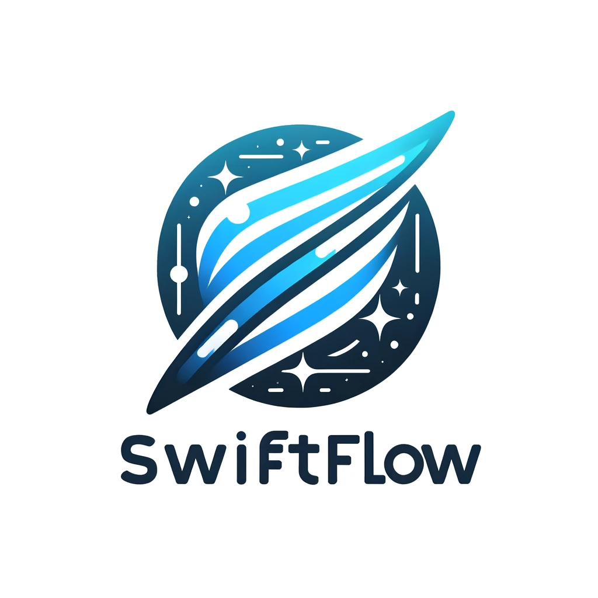
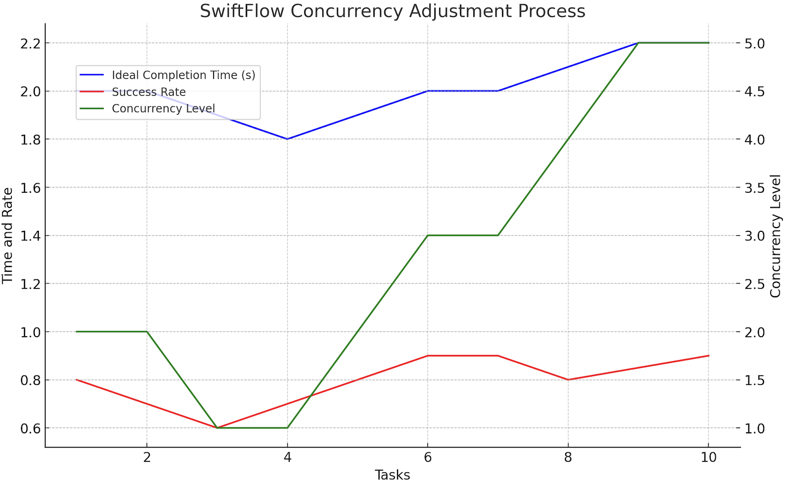

# SwiftFlow



SwiftFlow is an advanced task management system for Swift, designed to handle concurrent tasks with dynamic performance adjustment efficiently. It uses an adaptive algorithm to optimize task execution based on system load and task performance, ensuring smooth and efficient task handling.

## Features

- Dynamic concurrency adjustment based on task completion times.
- Task prioritization with aging mechanism.
- Customizable task execution blocks.
- Performance metrics tracking for each task.

## Installation

Clone the SwiftFlow repository:

```bash
git clone https://github.com/jwoody02/SwiftFlow.git
```
copy `SwiftFlow.swift` from the Sources folder into your project. That's it!

# Usage
## Creating a Task
To create a task in SwiftFlow, you define the task's execution logic and specify completion handlers:
```swift
let task = TaskBuilder<{return types}>()
    .with(identifier: "uniqueTaskIdentifier")
    .with(priority: .medium)
    .with(executionBlock: { completion in
        // Task execution logic
        // Call completion(.success(data)) or completion(.failure(error)) when done
    })
    .then { result, metrics in
        // First completion handler
        // Handle the task result and metrics here
    }
    .then { result, metrics in
        // Additional completion handlers can be chained
    }
    .build()
```
Note: Simply creating a task does not automatically queue it for execution. This step only defines the task and its completion logic.

## Executing a Task
SwiftFlow provides three different ways to execute a task, each catering to different use cases:
### 1. Executing a Task Through SwiftFlow's Task Manager
This is the standard way to execute a task. It involves adding the task to SwiftFlow's task queue, where it's managed and executed based on its priority and the system's current load. This method is ideal for tasks that need to be managed and scheduled by SwiftFlow.
```swift
// Example of adding a task to SwiftFlow's task manager
let task = // ... [task creation code]
SwiftFlow.shared.addTask(task)
```
In this method, the task's completion handlers (defined via `.then`) are automatically called once the task is completed.

### 2. Direct Execution with Completion Handling
If you need immediate execution of a task without adding it to SwiftFlow's queue, you can directly call the `execute()` method with a completion block. This method is useful when you want to run a task immediately and handle its completion in one place.
```swift
// Example of executing a task immediately with a completion block
task.execute {
    // This block is called after all of the task's completion handlers have been executed
}
```
This method will execute all completion blocks added through the `.then` method, followed by the final completion block specified in `execute()`.

### 3. Direct Execution without Completion Handling
If you want to execute a task immediately and do not need any additional handling after the task's predefined completion logic, you can call the `execute()` method without any parameters. This is the simplest form of task execution, suitable when you just need to run a task and rely entirely on its predefined completion logic.
```swift
// Example of executing a task immediately without additional completion handling
task.execute()
```
This method executes the task and its chained .then completion handlers, but does not provide an additional completion block.

Each of these execution methods offers flexibility in how tasks are managed and executed, allowing SwiftFlow to be adaptable to different scenarios and requirements.

## Adding listeners for Task Completion
SwiftFlow allows you to add multiple listeners for a task, enabling different parts of your application to respond to the task's completion:
```swift
SwiftFlow.shared.addListener(for: "your-task-id") { result in
    self.handleTaskResult(result)
}
```
This feature is particularly useful for tasks that have wide-reaching effects or need to notify multiple components upon completion.
# Detailed Example: Image Downloading Task
SwiftFlow allows tasks to be easily defined as a class, making for easy initialization and clean code, here's an example of a Task class for downloading images:
```swift
class ImageDownloadTask: Task<Data> {
    let imageURL: URL

    init(imageURL: URL, priority: TaskPriority, completions: @escaping (TaskResult<Data>, TaskMetrics) -> Void) {
        self.imageURL = imageURL
        super.init(
            identifier: imageURL.absoluteString,
            priority: priority,
            executionBlock: { completion in
                // Perform the actual download
                URLSession.shared.dataTask(with: imageURL) { data, response, error in
                    // Check for errors, invalid response, or no data
                    if let error = error {
                        completion(.failure(error))
                        return
                    }
                    guard let httpResponse = response as? HTTPURLResponse, 200..<300 ~= httpResponse.statusCode else {
                        completion(.failure(TaskError.noResult))
                        return
                    }
                    guard let data = data else {
                        completion(.failure(TaskError.noResult))
                        return
                    }
                    // If everything is fine, return the downloaded data
                    completion(.success(data))
                }.resume()
            },
            completions: [completions]
        )
    }
}
```
And here's how we can use the previous class to cleanly download an image using SwiftFlow's priority queue and pass the results back:
```swift
let imageDownloadTask = ImageDownloadTask(
        imageURL: URL("https://example.com/test.png"),
        priority: .medium,
        completions: { result, metrics in
            switch result {
            case .success(let data):
                // Handle successful image download, e.g., cache or display the image
            case .failure(let error):
                // Handle error scenario
            }
        }
    )
    SwiftFlow.shared.addTask(imageDownloadTask)
```

# Detailed Example: Concurrent HTTP Requests
There's a practical example using SwiftFlow to manage concurrent HTTP requests:
```swift
class HTTPClient {
    static func makeRequest(to urlString: String, completion: @escaping (Result<String, Error>) -> Void) {
        guard let url = URL(string: urlString) else {
            completion(.failure(URLError(.badURL)))
            return
        }

        let task = URLSession.shared.dataTask(with: url) { data, response, error in
            if let error = error {
                completion(.failure(error))
                return
            }

            guard let data = data, let responseString = String(data: data, encoding: .utf8) else {
                completion(.failure(URLError(.cannotParseResponse)))
                return
            }

            completion(.success(responseString))
        }

        task.resume()
    }
}

class ExampleClass {
    func createHTTPRequestTask(urlString: String, priority: TaskPriority) -> Task<Result<String, Error>> {
        let task = TaskBuilder<Result<String, Error>>()
            .with(identifier: UUID().uuidString)
            .with(priority: priority)
            .with(executionBlock: { taskCompletion in
                HTTPClient.makeRequest(to: urlString) { result in
                    // Wrap the standard Result in a TaskResult
                    let taskResult: TaskResult<Result<String, Error>> = .success(result)
                    taskCompletion(taskResult)
                }
            })
            .then { taskResult, metrics in
                // Handle the task result and metrics
                switch taskResult {
                case .success(let result):
                    switch result {
                    case .success(let response):
                        print("Success: \(response)")
                    case .failure(let error):
                        print("Error: \(error.localizedDescription)")
                    }
                case .failure(let error):
                    print("Task Error: \(error)")
                }
                print("Task Metrics: Wait Time: \(metrics.waitTime), Execution Time: \(metrics.executionTime)")
            }
            .build()

        return task
    }

    func executeExample() {
        let urls = ["https://api.publicapis.org/entries", "https://api.agify.io/?name=bella"]
        urls.forEach { urlString in
            let httpRequestTask = createHTTPRequestTask(urlString: urlString, priority: .medium)
            SwiftFlow.shared.addTask(httpRequestTask)
        }

        SwiftFlow.shared.debugPrintQueueStatus()
    }
}
```
In this example, `ExampleClass` demonstrates how to use SwiftFlow to handle multiple HTTP requests concurrently. Each request is encapsulated in a task with its own completion logic. The tasks are then queued and executed efficiently by SwiftFlow.

# Concurrency Adjustment Mechanism
SwiftFlow adjusts the concurrency level (aka the number of tasks that can run at once) based on the performance of tasks. The system calculates an ideal completion time for tasks and adjusts it based on the success rate of task completion.

## How It Works
 - Initial Ideal Time: Set to a default value (e.g., 2 seconds).
 - Success Rate Calculation: The percentage of tasks completing within the ideal time is calculated.
 - Adjusting Ideal Time:
   - The ideal time is increased if the success rate is above a threshold (e.g., 80%).
   - If the success rate is below the threshold, the ideal time is decreased.
 - Concurrency Adjustment:
   - Increase concurrency if the success rate is high. Aka: allow more tasks to run at once.
   - Decrease concurrency if the success rate is low. Aka: decrease the amount of allowed tasks at once
  
Below is an example diagram of how the mechanism works over time, as the number of tasks that complete in the target time increases, then that means we can allow more tasks to execute concurrently without slowing down the application:
    - Note: that the "Concurrency Level" is a numerical representation for the number of tasks that are allowed to execute at the same time
    - Over time, if tasks complete quick enough, the amount of tasks allowed at the same time will increase, and vice versa
    - In layman's terms: SwiftFlow will execute as many tasks concurrently as possible while still ensuring that latency is kept at a minimal level
    


## License
SwiftFlow is released under the MIT License. Feel free to use it for whatever you want!


