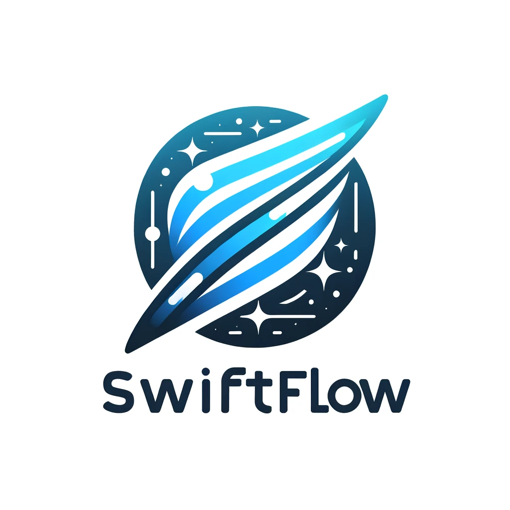

# SwiftFlow



SwiftFlow is an advanced task management system for Swift, designed to handle concurrent tasks with dynamic performance adjustment efficiently. It uses an adaptive algorithm to optimize task execution based on system load and task performance, ensuring smooth and efficient task handling.

## Features

- Dynamic concurrency adjustment based on task completion times.
- Task prioritization with aging mechanism.
- Customizable task execution blocks.
- Performance metrics tracking for each task.

## Installation

Clone the SwiftFlow repository:

```bash
git clone https://github.com/yourusername/SwiftFlow.git
```
copy `SwiftFlow.swift` from the Sources folder into your project. That's it!

## Usage
# Creating a Task
To create a task, define the task execution block and initialize a `Task` object:
```swift
// Create a network task with a unique identifier, give it medium priority
// Tasks can be given different priority levels depending on their importance
// more important tasks will be placed ahead of lower priority tasks

let networkTask = Task<String>(identifier: "networkRequest", priority: .medium) { completion in
    // Asynchronous network request
    someNetworkRequest { result, error in
        if let error = error {
            completion(.failure(error))
        } else if let result = result {
            completion(.success(result))
        } else {
            completion(.failure(TaskError.noResult))
        }
    }
}

// Handle task completion
networkTask.then { result, metrics in
    // this will be called when the task is done, do what you want with the result of the code, or keep track of metrics to optimize in the future.
    switch result {
    case .success(let data):
        print("Data: \(data)")
    case .failure(let error):
        print("Error: \(error)")
    }
    print("Execution Time: \(metrics.executionTime)")
}
```
PLEASE NOTE: simply creating a task will not add it to the task queue. All that we've done in the above example is define the code for a certain task, and what should be done upon its completion. To actually execute a task, use the `addTask` function as shown in the section below.

# Adding a Task to the Task Manager
Add your task to the TaskManager for execution:
```swift
SwiftFlow.shared.addTask(networkTask)
```
Tasks can be defined anywhere, all it takes is this one line to add the task to the queue and execute it again. Keep in mind, the task's `then` completion block will be called, you can update this completion block dynamically anywhere in your code as can be seen in the previous section `Creating a Task`.

## Concurrency Adjustment Mechanism
SwiftFlow adjusts the concurrency level (aka the number of tasks that can run at once) based on the performance of tasks. The system calculates an ideal completion time for tasks and adjusts it based on the success rate of task completion.

# How It Works
 - Initial Ideal Time: Set to a default value (e.g., 2 seconds).
 - Success Rate Calculation: The percentage of tasks completing within the ideal time is calculated.
 - Adjusting Ideal Time:
   - The ideal time is increased if the success rate is above a threshold (e.g., 80%).
   - If the success rate is below the threshold, the ideal time is decreased.
 - Concurrency Adjustment:
   - Increase concurrency if the success rate is high. Aka: allow more tasks to run at once.
   - Decrease concurrency if the success rate is low. Aka: decrease the amount of allowed tasks at once


## License
SwiftFlow is released under the MIT License. Feel free to use it for whatever you want!


